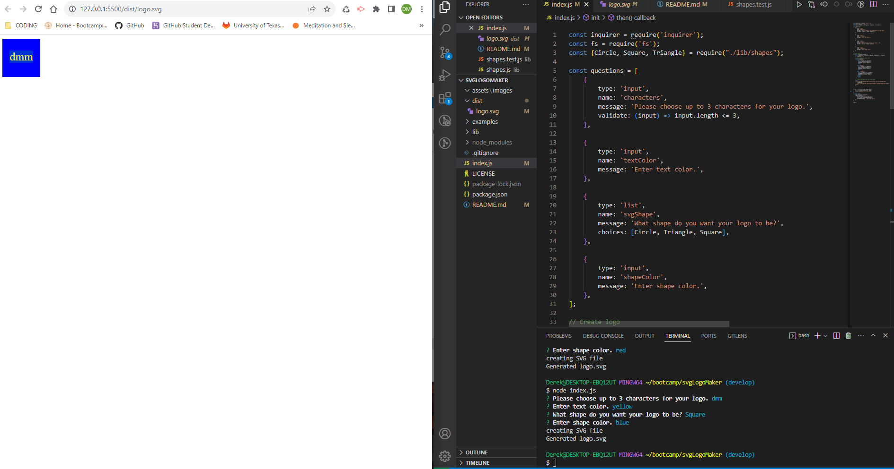

# SVG Logo Maker

## Description
- For this project, I created an application that can generate SVG logos based off of user input.
I built this project using JavaScript, Node.js, Inquirer version 8.2.4, and Jest version 29.7.
This app allows the user to create an SVG logo and to select the color of the logo's shape and text.
I learned from making this application how to use constructors and how to run tests using Jest.

## Installation
- This application needs Node.js, Inquirer version 8.2.4, and Jest version 29.7 to work correctly.

## Usage
- Enter 'node index.js' in terminal to start the program. Answers questions from the prompt to generate an SVG Logo. Enter 'npm test' to run Jest.

Video Demonstration:

https://drive.google.com/file/d/1Nzgw4B54JbPliFWN3FjgFfyUFBJolmYR/view

## Credits
N/A

## License
MIT
